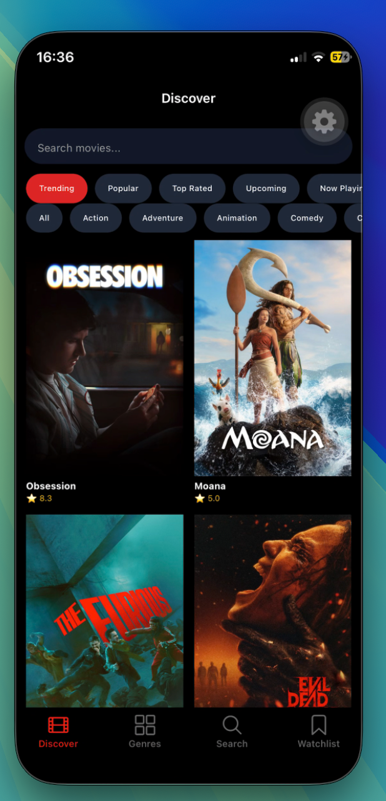
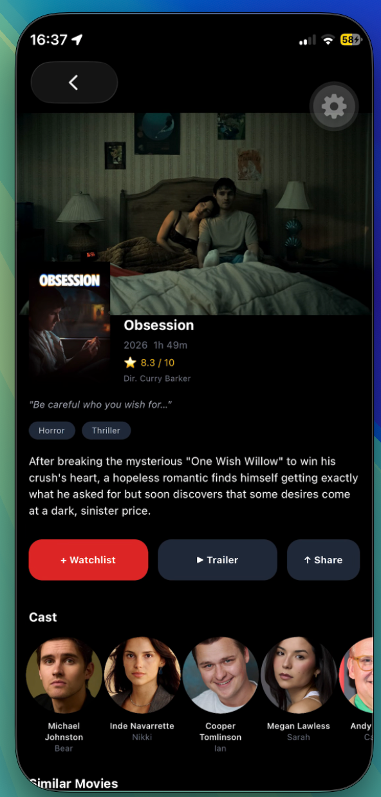
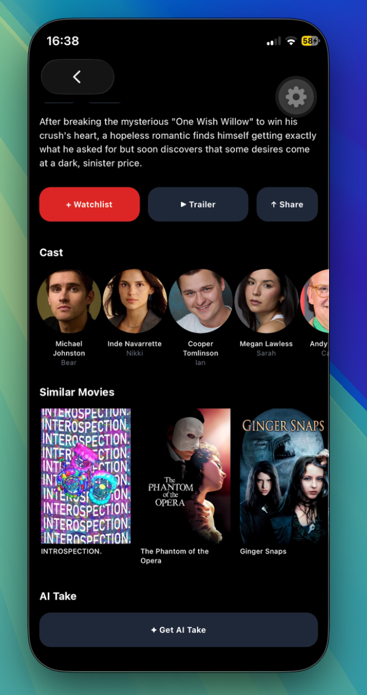
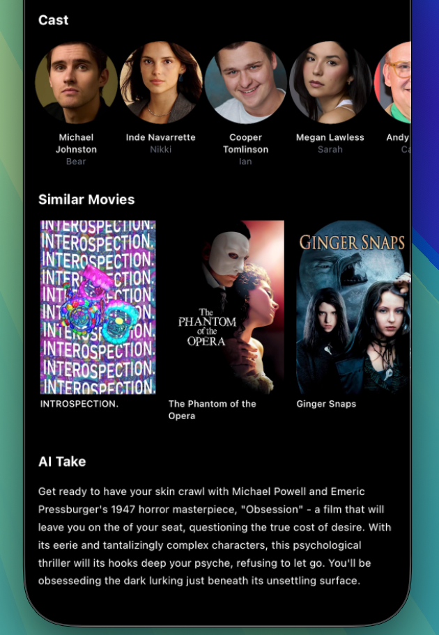
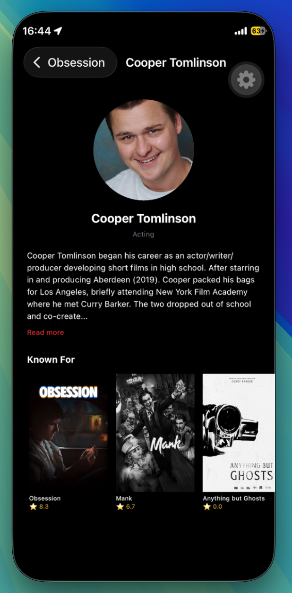
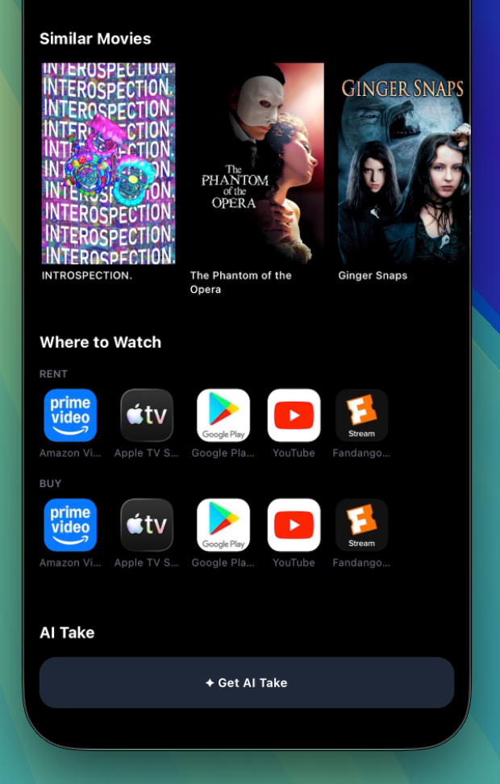
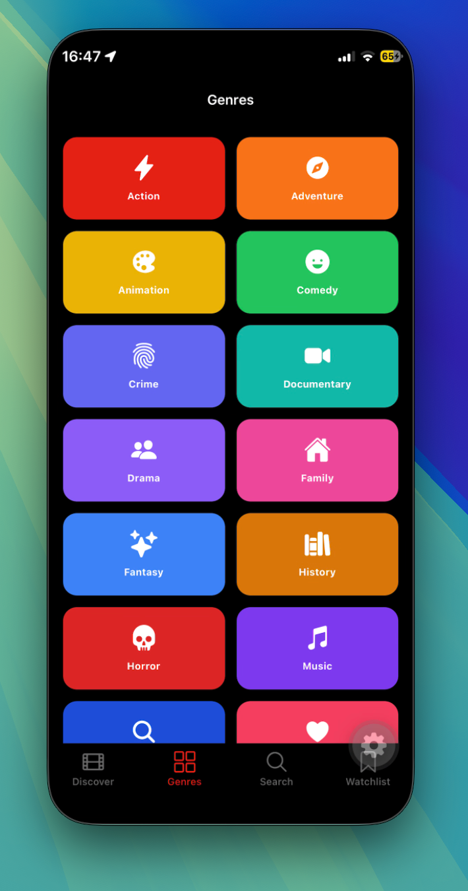
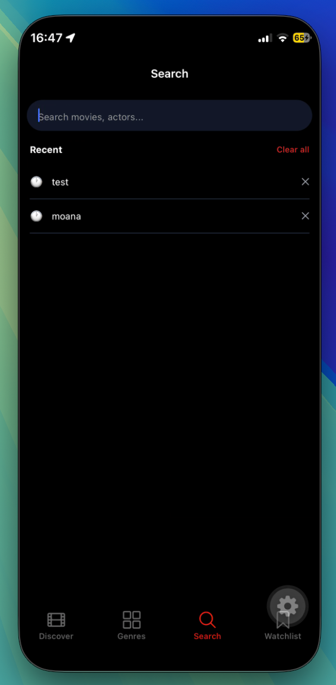
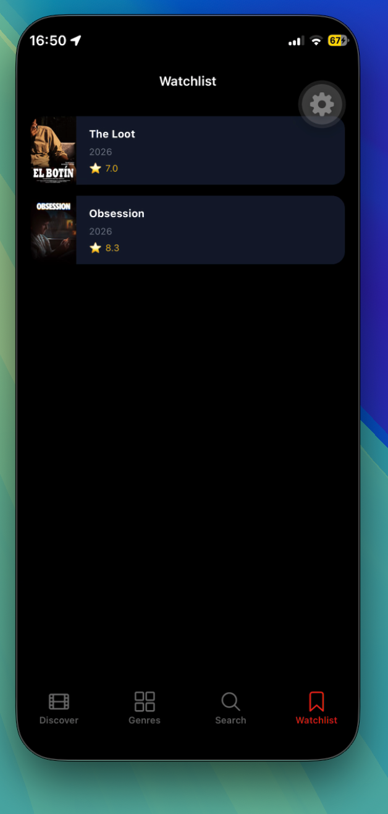

# Telemundo

A full-featured movie browser and watchlist app built with Expo SDK 57, React Native, and TypeScript. Browse trending movies, search by title or genre, save a watchlist, and get AI-powered takes on any film.

## Features

- Browse movies by category — Trending, Popular, Top Rated, Upcoming, Now Playing
- Filter by genre with a horizontal chip selector
- Full-text movie search with debounce and recent search history
- Movie detail screen with cast, trailer, similar movies, and share
- Person screen with biography and filmography
- Persistent watchlist backed by AsyncStorage
- Streaming AI movie take powered by Groq (llama-3.1-8b-instant)
- Skeleton loaders and haptic feedback throughout
- Dark mode support

## Tech Stack

| Layer | Library |
|-------|---------|
| Framework | Expo SDK 57 + Expo Router |
| Language | TypeScript |
| Styling | NativeWind v4 (Tailwind CSS) |
| State | Zustand |
| Data fetching | TanStack React Query |
| Storage | AsyncStorage |
| Images | expo-image |
| Haptics | expo-haptics |
| Browser | expo-web-browser |
| AI | Groq API (streaming) |
| Data | TMDB API |

## Prerequisites

- Node.js 18+
- Xcode (for iOS simulator or device builds)
- A [TMDB API](https://www.themoviedb.org/settings/api) account — use the **Read Access Token** (long JWT)
- A [Groq](https://console.groq.com) account — free, no credit card required

## Setup

**1. Clone and install**

```bash
git clone <your-repo-url>
cd telemundo
npm install
```

**2. Create your `.env` file**

```bash
cp .env.example .env
```

Then fill in your keys:

```
EXPO_PUBLIC_TMDB_TOKEN=your_tmdb_read_access_token
EXPO_PUBLIC_GROQ_API_KEY=your_groq_api_key
```

> The TMDB token is the long JWT Bearer token, not the short API key.

**3. Build and run**

For iOS simulator:
```bash
npx expo run:ios
```

For a specific simulator:
```bash
npx expo run:ios --device "<simulator name>"
```

For a physical iPhone — open Xcode, connect your device, select it from the device dropdown, and hit Play. Then run:
```bash
npx expo start
```

> **Note:** Expo Go is not supported. A native development build is required.

## Project Structure

```
src/
  app/
    (tabs)/         # Tab screens: Discover, Genres, Search, Watchlist
    movie/[id].tsx  # Movie detail screen
    person/[id].tsx # Person / actor screen
    genre/[id].tsx  # Genre movie list screen
    lib/
      tmdb.ts       # TMDB API client (rate limiting, caching, retry)
      ai.ts         # Groq streaming AI take
      storage.ts    # AsyncStorage helpers (watchlist, recent searches)
      cache.ts      # In-memory TTL cache
      rateLimit.ts  # Sliding window rate limiter + request deduplication
    store/
      watchlist.ts  # Zustand watchlist store
    components/
      Skeleton.tsx          # Animated pulse skeleton block
      MovieCardSkeleton.tsx # Movie card shaped skeleton
  types/
    tmdb.ts         # TypeScript interfaces for TMDB API responses
assets/
  images/           # App icon and splash screen
```

## Environment Variables

| Variable | Description |
|----------|-------------|
| `EXPO_PUBLIC_TMDB_TOKEN` | TMDB Read Access Token (JWT) |
| `EXPO_PUBLIC_GROQ_API_KEY` | Groq API key for AI take feature |

## API Details

- **TMDB** — rate limited to 35 requests per 10 seconds with exponential backoff retry. Responses are cached in memory with TTL (5 min trending, 30 min details, 1 hr genres).
- **Groq** — uses `llama-3.1-8b-instant`, streamed via `ReadableStream`. Free tier allows 14,400 requests/day.

## Screenshots


### movie[id]


### movie[id]


### movie[id] --AIªsummary 


### movie[persona[id]]


### where to watch suggestions


### category listings


### Remember search


### watchlist
